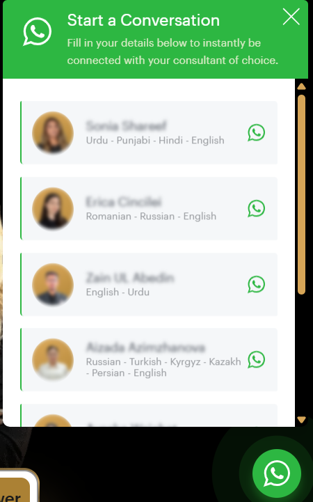
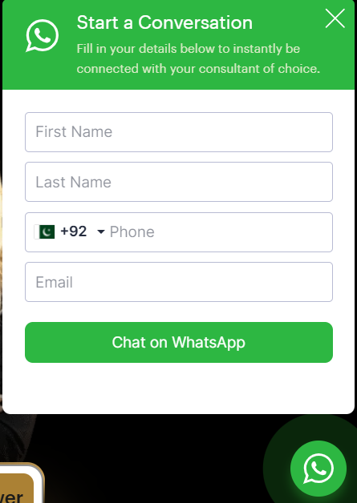

# advanced-whatsapp-chat-for-wordpress

A WordPress plugin for an advanced floating WhatsApp widget (g12-child style behavior).

## Features

- Floating WhatsApp launcher with pulse animation
- Popup chat panel with open/close interaction
- Team member cards (name, language, avatar)
- Per-member form loading:
  - `form_url` (loads iframe form)
  - `form_details` (loads inline HTML form)
- Auto appends `s_url` tracking parameter to WhatsApp links
- Supports left/right position
- Optional shortcode: `[awcwp_chat]`

## Files

- `advanced-whatsapp-chat-for-wordpress.php` (main plugin loader)
- `includes/class-awcwp-settings.php` (admin settings page)
- `assets/css/awcwp-chat.css` (advanced widget styles)
- `assets/js/awcwp-chat.js` (advanced widget behavior)
- `preview.html` (standalone advanced preview)
- `assets/css/preview-g12-demo.css` (preview-only styles)
- `assets/js/preview-g12-demo.js` (preview-only behavior)

## Quick Use

1. Upload this folder to your WordPress `wp-content/plugins` directory.
2. Activate **Advanced WhatsApp Chat for WordPress** in wp-admin.
3. Go to **Settings > WhatsApp Chat**.
4. Edit heading/title and `Team Members (JSON)`.
5. Save settings.

## Team Members JSON Schema

Each member object supports:

- `name`
- `language`
- `number`
- `predefined_text`
- `form_details`
- `form_url`
- `avatar_url`
- `status` (`1` to hide member)
- `order`

## Preview

### Screenshot 1

### Screenshot 2

